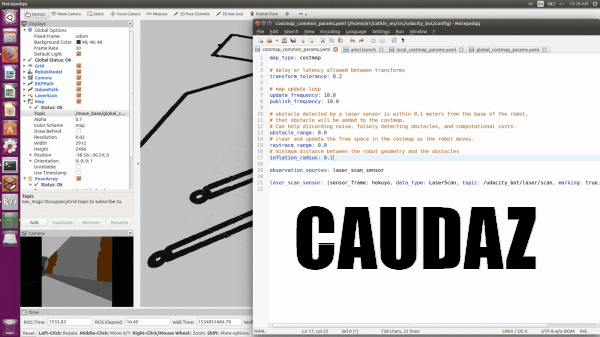

# Robotics Nanodegree #

## Term2 – Project2: Where Am I? (Particle Filters) ##


UPDATE ROS Packages

```
sudo apt-get install ros-kinetic-navigation

sudo apt-get install ros-kinetic-map-server

sudo apt-get install ros-kinetic-move-base

rospack profile

sudo apt-get install ros-kinetic-amcl

```
CREATE CATKIN WORKSPACE

```
mkdir -p ~/catkin_ws/src

cd ~/catkin_ws/src

catkin_init_workspace

git clone https://github.com/caudaz/robotND2-proj2

cd ~/catkin_ws

catkin_make

```
TERMINAL1 (launches GAZEBO and RVIZ)

```
cd ~/catkin_ws

source devel/setup.bash

roslaunch udacity_bot udacity_world.launch

```
TERMINAL2 (launches AMCL node)

```
cd ~/catkin_ws

source devel/setup.bash

roslaunch udacity_bot amcl.launch

```
(NOTE: at this point you can still set the 2D navigation goal manually
on RVIZ)

TERMINAL3 (launches navigation goal)

```
cd ~/catkin_ws

source devel/setup.bash

rosrun udacity_bot navigation_goal
```


## ABSTRACT ##

This project attempts to solve the problem of local and global
localization of a robot. Such a problem could be encountered on a
factory floor or on a home robot such as the Roomba. The project
utilizes Particle Filters for Localization. The implementation is done
using ROS, Gazebo, and RVIZ.

## INTRO ##

This project involves:

-   building your own simulated mobile robot, added sensors to it, and
    integrated it with Gazebo and RViz by developing a ROS package for
    that robot.

-   integrating ROS packages like the Adaptive Monte Carlo Localization
    (AMCL) package and the Navigation Stack, that allows your robot to
    navigate and localize itself in a particular environment or map.

-   tuning different parameters corresponding to these packages that
    improve results

## BASIC ROBOT MODEL ##

The basic model for GAZEBO is defined in the URDF folder:
udacity\_bot.xacro (XML file) . It defines:

* geometry (for visual and collision)

* mass/inertia

* links (rigid bodies)

* joints

It consists of a base(blue), two actuators (wheels in green joined by a
differential model), a camera (red), and a laser sensor (gray/black):


## GAZEBO PLUGINS ##

Since the URDF file cannot perform actions such as take images during
simulation, plugins (included in the udacity\_bot.gazebo file) are used
for:

* camera sensor

* Hokuyo sensor

* controlling the wheel joints (libgazebo_ros_diff_drive.so)

## RVIZ Integration ##

To visualize any type of sensor data being published over a ROS topic, RVIZ is used for:

* camera images

* points cloud from laser

* maps

## GAZEBO Map ##

The “map” folder contains files: jackal_race.pgm and jackal_race.yaml.
These will be visualized in GAZEBO (but not on RVIZ).

## Particle Filter (AMCL Package) ##

A ROS package for Adaptive Monte Carlo Localization (AMCL) is used on
the project. It changes the number of particles over time, being
computationally more efficient than MCL.

## Navigation Stack ##

The move_base package from ROS will be used, so that a goal position
can be defined in RVIZ and the robot will navigate to it. It uses
costmap, which divides the map into occupied and unoccupied areas. The
package has:

* built-in correction to navigate around obstacles

* detect if the robot is stuck

* rotate until it finds a clear path ahead

The local costmap only displays what the laser sensor captures during
that time period:


The global costmap displays all occupied areas plus an inflated radius
(shown in blue):


The “Inflated Radius” parameter will influence the blue area on the
maps. Below is a comparison of a R=0.1m vs. R=10.0m parameter:




## PARAMETER TUNING ##

Parameters in the config and launch folders were modified to allow the
robot to reach the goal in an accurate and timely manner. All parameters
were tested/tuned to balance the tradeoff between accuracy and
computational cost:
* transform tolerance : higher delay (faster processing), lower delay (more accurante transforms between coordinate systems)
* update/publish frequencies: higher freq (more accuracy for location), lower freq (faster processing)
* obstacle/clear range: higher distance (clears noise, more obstacles)
* inflation radius : helps to clear obstacles, but could narrow passages if too high
* maps size width and height + resolution: the higher the better for accuracy, but too much computational time and memory usage
* amcl min/max particles: since the algorithm can vary the # of particles (compared to MCL), min too low not enough accuracy, max too high too much computational time
* laser likelihood_field is more computationally efficient and reliable
* odom diff-corrected type drives the robot, but also has the equations for a differential going on a turn

costmap_common_params.yaml
```
# delay or latency allowed between transforms
transform_tolerance: 0.2
# map update loop
update_frequency: 10.0
publish_frequency: 10.0
# obstacle detected by a laser sensor is within 0.1 meters from the base of the robot, 
# that obstacle will be added to the costmap. 
# Can help discarding noise, falsely detecting obstacles, and computational costs.
obstacle_range: 3.0
# clear and update the free space in the costmap as the robot moves.
raytrace_range: 3.0
# minimum distance between the robot geometry and the obstacles
inflation_radius: 0.15
```

local_costmap_params.yaml
```
   width:  5.0   # original 20.0
   height: 5.0   # original 20.0
   resolution: 0.05
```
 
global_costmap_params.yaml
```
   width:  15.0 # original 40.0
   height: 15.0 # original 40.0
   resolution: 0.15 # original 0.05
```
   
amcl.launch (for localization)
```
    <!--delay or latency allowed between transforms-->
    <param name="transform_tolerance" value="0.2"/>
    <!-- tuned based on your system specifications-->
    <!--A larger range, with a high maximum might be too computationally extensive for a low-end system-->
    <param name="min_particles" value="20"/>
    <param name="max_particles" value="80"/>
    <!--Upon receiving a laser scan, it checks the values for update_min_a and update_min_d and compares to how far the robot has moved-->
    <!--Decides whether or not to perform a filter update or to discard the scan data-->
    <!--Discarding data could result in poorer localization results-->
    <!--and too many frequent filter updates for a fast moving robot could also cause computational problems-->
    <param name="update_min_d" value="0.01"/>
    <param name="update_min_a" value="0.01"/>
    <!--The likelihood_field model is usually more computationally efficient and reliable-->
    <!--for an environment such as the one you are working with.   -->
    <param name="laser_model_type" value="likelihood_field"/>
    <param name="laser_min_range" value="0.4"/>
       <!--laser_max_beams-->
       <param name="laser_z_hit"  value="0.8"/>
       <param name="lazer_z_rand" value="0.2" />
    <!--Since you are working with a differential drive mobile robot, it’s best to use the diff-corrected type-->
    <param name="odom_model_type" value="diff-corrected"/>
        <param name="odom_alpha1" value="0.02"/>
        <param name="odom_alpha2" value="0.02"/>
        <param name="odom_alpha3" value="0.02"/>
        <param name="odom_alpha4" value="0.02"/>	
```

## RESULTS ##

The robot model was able to reach the goal position while displaying the
PoseArray on RVIZ:


## DISCUSSION ##

The AMCL would not work well for a kidnapped robot problem. MCL and AMCL
could be used in applications for factory floors or home robots (such as
the Roomba).

The use of MCL is better for this project because of the ease of
implementation and it’s robustness over EKF. MCL can also use raw
measurements vs. EKF’s landmarks. MCL also does Global Localization
whereas EKF can’t.

## CONCLUSION/FUTURE WORK ##

The AMCL model was able to reach the desired position goal in a timely
manner.

The robot could be improved by the addition of more sensors such as
sonar for close range measurements.

This ROS model could be deployed in actual hardware by using the
following hardware:

<https://ubiquityrobotics.com/magni.html>

The Magni is a robot capable of carrying 100kilos, it has motors,
sensors for navigation, battery, and it’s brains are a Raspberry Pi 3
running UBUNTU and ROS, so the simulation done on this project can be
moved over to the robot with ease.
